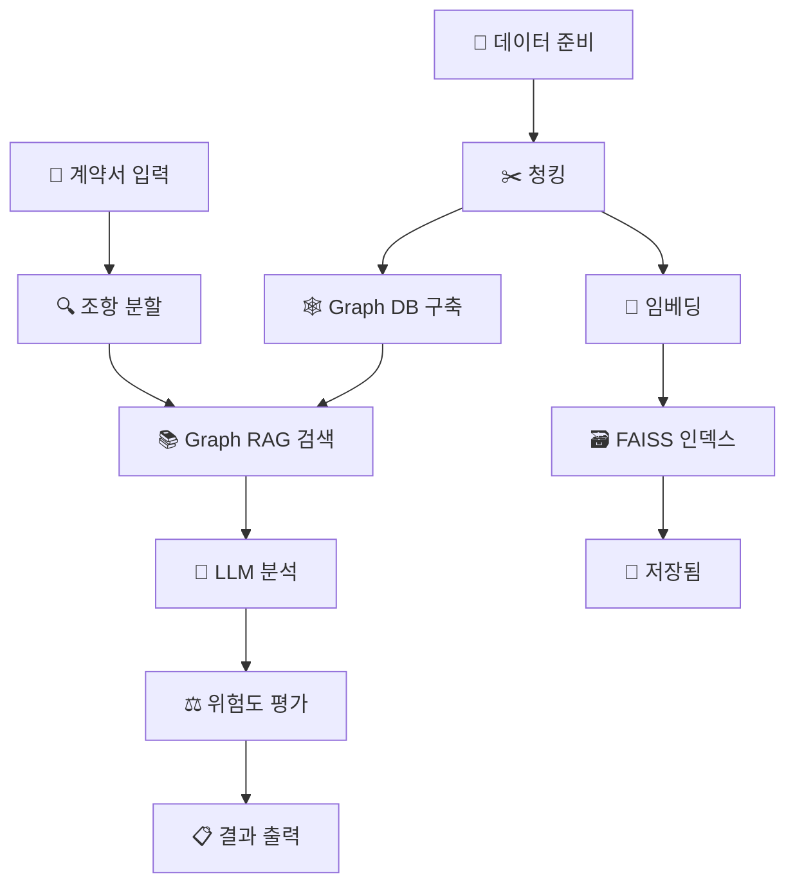

# 🛡️ Guardify-AI: AI 기반 불공정 약관 탐지 시스템

## 📋 목차

1. [시스템 개요](#시스템-개요)
2. [전체 프로세스 흐름](#전체-프로세스-흐름)
3. [실행 가이드](#실행-가이드)
4. [파일별 역할 설명](#파일별-역할-설명)
5. [핵심 소스코드 분석](#핵심-소스코드-분석)

---

## 🎯 시스템 개요

Guardify-AI는 **Vector RAG + Graph RAG**를 결합한 하이브리드 AI 시스템으로, 계약서의 불공정 약관을 자동으로 탐지하고 법적 근거와 개선 방안을 제시합니다.

### 🔧 핵심 기술 스택

- **Vector RAG**: FAISS 기반 유사도 검색
- **Graph RAG**: Neo4j 기반 법적 관계 추론
- **LLM**: OpenAI GPT-4o-mini
- **임베딩**: SentenceTransformers (all-MiniLM-L6-v2)

### 📊 데이터 우선순위

- **법령 (law)**: 우선순위 1.0 - 법적 근거 제공
- **표준약관 (standard)**: 우선순위 0.8 - 기준 비교
- **보도자료 (reference)**: 우선순위 0.3 - 실제 사례

---

## 🔄 전체 프로세스 흐름



### 📈 프로세스 단계별 설명

#### 🚀 **실시간 실행 단계** (매번 실행)

1. **계약서 입력** → `ai_unfair_detector.py`
2. **조항 분할** → "제n조" 패턴으로 분할
3. **Graph RAG 검색** → 법적 맥락 수집
4. **LLM 분석** → 불공정성 판단
5. **결과 출력** → JSON + 마크다운 보고서

#### 🔧 **데이터 구축 단계** (데이터 업데이트 시에만)

1. **데이터 준비** → PDF/Excel 파일 준비
2. **청킹** → `extract_and_chunk_v2.py`
3. **임베딩** → `embed_and_index.py`
4. **Graph DB 구축** → `build_graph_rag.py`

---

## 🚀 실행 가이드

### 📋 사전 준비사항

#### 1. 환경 설정

```bash
# 가상환경 활성화
source venv/bin/activate

# 환경변수 설정 (.env 파일)
OPENAI_API_KEY=your_openai_api_key
NEO4J_URI=bolt://localhost:7687
NEO4J_USER=neo4j
NEO4J_PASSWORD=your_password
```

#### 2. Neo4j 데이터베이스 실행

```bash
# Docker로 Neo4j 실행
docker run -d \
  --name neo4j-graphrag \
  -p 7474:7474 -p 7687:7687 \
  -e NEO4J_AUTH=neo4j/your_password \
  neo4j:5.14.0
```

### 🔄 **데이터 구축** (새 데이터 추가 시에만 실행)

#### Step 1: 데이터 청킹

```bash
python scripts/extract_and_chunk_v2.py
```

- **입력**: `data/law/`, `data/standard/`, `data/contracts/`
- **출력**: `outputs/chunks_v2.jsonl`

#### Step 2: Vector RAG 구축

```bash
python scripts/embed_and_index.py
```

- **입력**: `outputs/chunks_v2.jsonl`
- **출력**: `outputs/faiss_v2.index`, `outputs/faiss_v2_meta.pkl`

#### Step 3: Graph RAG 구축

```bash
python scripts/build_graph_rag.py
```

- **입력**: `outputs/chunks_v2.jsonl`
- **출력**: Neo4j 그래프 데이터베이스

### 🎯 **실시간 분석** (매번 실행)

#### 계약서 분석 실행

```bash
# 기본 샘플 계약서 분석
python scripts/ai_unfair_detector.py

# 특정 파일 분석
python scripts/ai_unfair_detector.py --file your_contract.txt
```

#### 결과 확인

- **콘솔 출력**: 실시간 분석 결과
- **JSON 파일**: `results/analysis_YYYYMMDD_HHMMSS/ai_detection_result.json`
- **마크다운 보고서**: `results/analysis_YYYYMMDD_HHMMSS/analysis_report.md`

---

## 📁 파일별 역할 설명

### 🎯 **핵심 실행 파일**

#### `scripts/ai_unfair_detector.py` - **메인 실행 파일**

- **역할**: 전체 불공정 약관 탐지 프로세스 오케스트레이션
- **기능**:
  - 계약서 조항 분할
  - Graph RAG 기반 법적 맥락 수집
  - LLM 기반 불공정성 분석
  - 결과 보고서 생성

### 🔧 **데이터 구축 파일**

#### `scripts/extract_and_chunk_v2.py` - **데이터 청킹**

- **역할**: 원본 문서를 AI가 처리할 수 있는 청크로 분할
- **기능**:
  - PDF/Excel 파일 텍스트 추출
  - 문서 유형별 청킹 전략 적용
  - 우선순위 메타데이터 추가

#### `scripts/embed_and_index.py` - **Vector RAG 구축**

- **역할**: 텍스트 청크를 벡터로 변환하고 FAISS 인덱스 생성
- **기능**:
  - SentenceTransformers 임베딩 생성
  - 우선순위 기반 가중치 적용
  - FAISS 인덱스 구축

#### `scripts/build_graph_rag.py` - **Graph RAG 구축**

- **역할**: 법적 엔티티와 관계를 추출하여 Neo4j 그래프 구축
- **기능**:
  - 법적 엔티티 추출 (조항, 법령, 개념 등)
  - 엔티티 간 관계 추출
  - Neo4j 그래프 데이터베이스 구축

### 🗄️ **데이터베이스 모듈**

#### `db/neo4j_client.py` - **Neo4j 클라이언트**

- **역할**: Neo4j 데이터베이스 연결 및 기본 CRUD 작업
- **기능**: 연결 관리, 노드/관계 생성, 쿼리 실행

#### `db/entity_extractor.py` - **법적 엔티티 추출기**

- **역할**: 텍스트에서 법적 엔티티와 관계를 자동 추출
- **기능**: 정규식 기반 엔티티 인식, 관계 매핑

#### `db/graph_builder.py` - **그래프 구축기**

- **역할**: 추출된 엔티티와 관계로 Neo4j 그래프 구축
- **기능**: 노드 생성, 관계 설정, 인덱스 생성

#### `db/graph_retriever.py` - **그래프 검색기**

- **역할**: Graph RAG 기반 법적 맥락 검색
- **기능**: 직접 검색, 엔티티 기반 검색, 확장 검색

### 🤖 **AI 모듈**

#### `models/llm_handler.py` - **LLM 핸들러**

- **역할**: OpenAI GPT-4o-mini와의 상호작용 관리
- **기능**: 프롬프트 구성, API 호출, 응답 파싱

---

## 🔍 핵심 소스코드 분석

### 🎯 **메인 실행 파일** (`ai_unfair_detector.py`)

#### 핵심 클래스: `AIUnfairDetector`

```python
class AIUnfairDetector:
    def __init__(self):
        # LLM 핸들러 초기화
        self.llm_handler = LLMHandler()

        # Neo4j 클라이언트 초기화
        self.neo4j_client = Neo4jClient()

        # Graph 검색기 초기화
        self.graph_retriever = GraphRetriever(self.neo4j_client)

        # 문서 우선순위 설정
        self.document_priority = {
            "law": {"weight": 1.0, "description": "법령"},
            "standard": {"weight": 0.8, "description": "표준약관"},
            "reference": {"weight": 0.3, "description": "보도자료/사례"}
        }
```

#### 핵심 메서드: `detect_unfair_clauses`

```python
def detect_unfair_clauses(self, contract_text: str) -> Dict[str, Any]:
    """불공정 약관 탐지 메인 로직"""

    # 1. 조항 분할
    clauses = self._split_into_sentences(contract_text)

    detection_results = []

    for i, clause in enumerate(clauses, 1):
        # 2. 법적 맥락 수집 (Graph RAG)
        legal_context = self._collect_legal_context(clause)

        # 3. LLM 분석
        analysis = self.llm_handler.analyze_clause(clause, legal_context)

        # 4. 결과 저장
        detection_results.append(DetectionResult(
            clause_text=clause,
            analysis=analysis,
            legal_context=legal_context
        ))

    # 5. 전체 위험도 계산
    overall_risk = self._calculate_overall_risk(detection_results)

    return {
        "detection_results": detection_results,
        "overall_risk_score": overall_risk,
        "risk_level": self._get_risk_level(overall_risk),
        "summary": self._generate_summary(detection_results, overall_risk)
    }
```

### 🔍 **Graph RAG 검색** (`graph_retriever.py`)

#### 핵심 메서드: `search`

```python
def search(self, query: str, max_results: int = 10) -> List[GraphSearchResult]:
    """Graph RAG 기반 검색"""

    # 1. 직접 텍스트 검색
    direct_results = self._direct_search(query, limit=max_results//3)

    # 2. 엔티티 기반 검색
    query_entities = self.entity_extractor.extract_entities(query)
    entity_results = self._entity_based_search(query_entities, limit=max_results//3)

    # 3. 확장 검색 (관련 엔티티)
    expansion_results = self._expansion_search(query_entities, limit=max_results//3)

    # 4. 결과 통합 및 정렬
    all_results = direct_results + entity_results + expansion_results
    return self._deduplicate_and_rank(all_results, query)
```

### 🤖 **LLM 분석** (`llm_handler.py`)

#### 핵심 메서드: `analyze_clause`

```python
def analyze_clause(self, clause_text: str, legal_context: List[LegalContext]) -> UnfairClauseAnalysis:
    """조항 불공정성 분석"""

    # 1. 법적 맥락 포맷팅
    context_text = self._format_legal_context(legal_context)

    # 2. 프롬프트 구성
    system_prompt = """
    당신은 법률 전문가입니다. 주어진 조항이 불공정한지 분석하고
    법적 근거와 개선 방안을 제시해주세요.
    """

    user_prompt = f"""
    조항: {clause_text}

    관련 법적 맥락:
    {context_text}

    다음 JSON 형식으로 응답해주세요:
    {{
        "is_unfair": boolean,
        "risk_level": "Low|Medium|High",
        "confidence": 0.0-1.0,
        "reason": "판단 근거",
        "legal_basis": ["관련 법조문"],
        "suggestion": "개선 방안"
    }}
    """

    # 3. LLM 호출 및 응답 파싱
    response = self.client.chat.completions.create(
        model="gpt-4o-mini",
        messages=[
            {"role": "system", "content": system_prompt},
            {"role": "user", "content": user_prompt}
        ],
        response_format={"type": "json_object"}
    )

    # 4. 응답 파싱
    result = json.loads(response.choices[0].message.content)
    return UnfairClauseAnalysis(**result)
```

### 🔢 **Vector RAG 구축** (`embed_and_index.py`)

#### 핵심 로직

```python
# 1. 청크 로드
texts = []
meta = []
with open(CHUNKS_FILE, "r", encoding="utf-8") as f:
    for line in f:
        obj = json.loads(line)
        texts.append(obj["text"])
        meta.append({
            "chunk_id": obj.get("chunk_id"),
            "source_file": obj.get("source_file"),
            "source_tag": obj.get("source_tag"),
            "priority": obj.get("priority", 0.5)
        })

# 2. 임베딩 생성
model = SentenceTransformer("all-MiniLM-L6-v2")
embeddings = model.encode(texts, show_progress_bar=True, batch_size=64)
embeddings = np.array(embeddings).astype("float32")

# 3. 우선순위 기반 가중치 적용
for i, m in enumerate(meta):
    priority = m.get("priority", 0.5)
    embeddings[i] = embeddings[i] * priority

# 4. FAISS 인덱스 생성
d = embeddings.shape[1]
faiss.normalize_L2(embeddings)
index = faiss.IndexFlatIP(d)
index.add(embeddings)

# 5. 저장
faiss.write_index(index, INDEX_FILE)
with open(META_FILE, "wb") as f:
    pickle.dump(meta, f)
```

---

## 🎉 결론

Guardify-AI는 **Vector RAG + Graph RAG**의 하이브리드 접근법으로 법적 맥락을 정확하게 이해하고 불공정 약관을 탐지합니다.

### 🚀 **주요 장점**

- **정확한 법적 분석**: Graph RAG로 법적 관계 추론
- **빠른 검색**: FAISS 기반 벡터 검색
- **우선순위 기반**: 법령 > 표준약관 > 보도자료
- **자동화된 보고서**: JSON + 마크다운 출력

### 📈 **사용 시나리오**

- **법무팀**: 계약서 사전 검토
- **컴플라이언스**: 규정 준수 확인
- **소비자 보호**: 불공정 약관 사전 차단

이 시스템을 통해 계약서의 불공정 약관을 사전에 탐지하고 개선할 수 있습니다.
